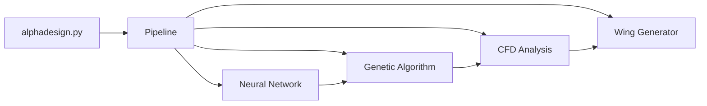
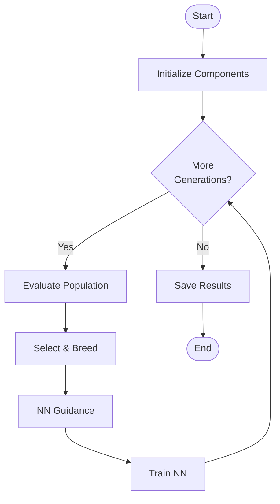
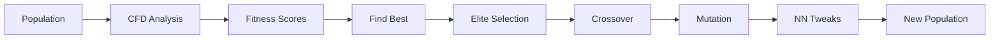
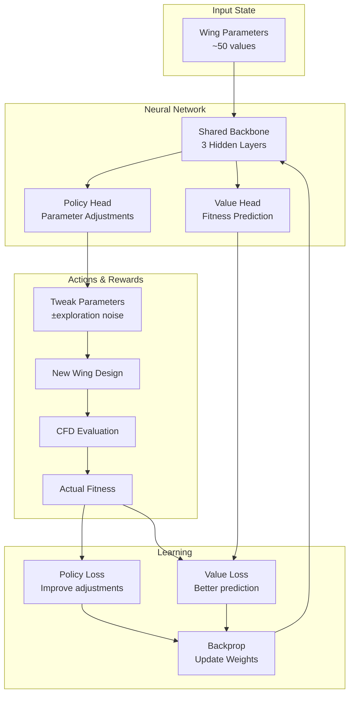
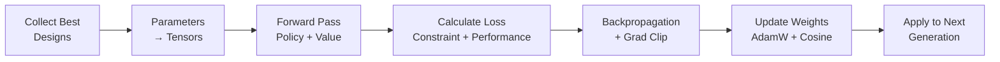

# AlphaDesign System Flowcharts

## 1. System Architecture

## 2. Main Execution Flow

## 3. Single Generation

## 4. RL Flow (Policy-Value Network)

## 5. RL Training Cycle

## Key Components

| Component | Purpose |
|-----------|---------|
| **Genetic Algorithm** | Evolves wing designs through selection, crossover, mutation |
| **Policy Network** | Learns which parameter adjustments improve designs |
| **Value Network** | Predicts fitness score before expensive CFD |
| **CFD Analysis** | Evaluates aerodynamic performance from STL geometry |
| **Wing Generator** | Creates 3D STL models from parameters |
| **Constraints** | Enforces FIA 2024 F1 regulations |

## How It Works

1. **Initialize**: Create random population of wing designs
2. **Evaluate**: Run CFD analysis on each design → fitness scores
3. **Select**: Keep best designs (elites) + tournament selection
4. **Breed**: Crossover + mutation → new offspring
5. **RL Guidance**: Policy network suggests parameter tweaks based on learned patterns
6. **RL Training**: Value network learns to predict fitness, policy learns better adjustments
7. **Curriculum**: Early focus on constraints → later focus on performance
8. **Repeat**: Loop until max generations or time limit
9. **Output**: Best STL designs + trained RL agent

## Outputs

- `stl_outputs/generation_XXX_best_design.stl` - Best wing designs
- `checkpoints/checkpoint_gen_XXX.json` - Population snapshots
- `neural_networks/network_gen_XXX.pth` - NN weights
- `cfd_results/genX_indY_cfd_results.json` - Cached CFD data

