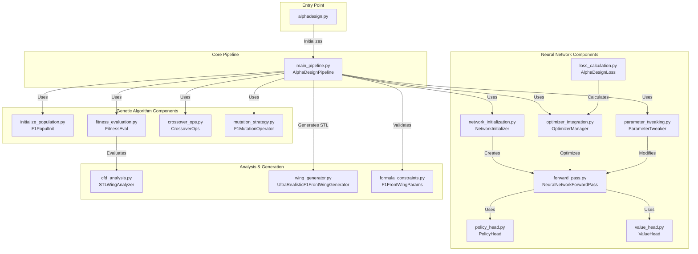
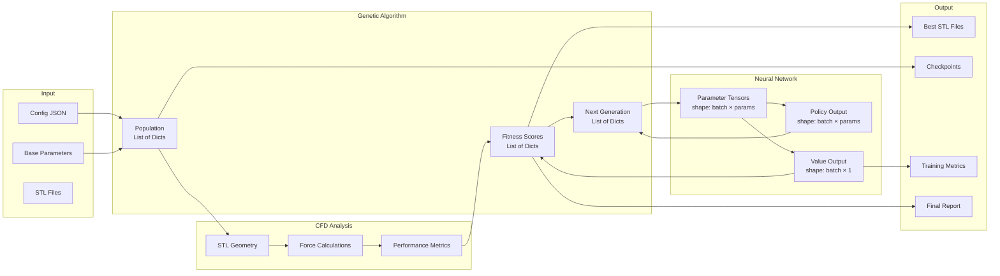

# AlphaDesign System Architecture & Flow Diagrams

## 1. System Architecture Overview

## 2. Main Pipeline Execution Flow

```mermaid
flowchart TD
    Start([Start AlphaDesign]) --> LoadConfig[Load Configuration<br/>config.json]
    LoadConfig --> LoadParams[Load Base Parameters<br/>F1FrontWingParams]

    LoadParams --> Phase1[PHASE 1: Initialize Components]

    Phase1 --> InitGA[Initialize Genetic Algorithm<br/>- PopulInit<br/>- FitnessEval<br/>- CrossoverOps<br/>- MutationOps]

    InitGA --> CheckNN{Neural Network<br/>Enabled?}
    CheckNN -->|Yes| InitNN[Initialize Neural Network<br/>- NetworkInitializer<br/>- OptimizerManager<br/>- LossCalculator<br/>- ParameterTweaker]
    CheckNN -->|No| CreatePop
    InitNN --> CreatePop[Create Initial Population]

    CreatePop --> Phase2[PHASE 2: Optimization Loop]

    Phase2 --> GenLoop{Generation < Max<br/>AND<br/>Time < Max?}

    GenLoop -->|Yes| RunGen[Run Single Generation]
    GenLoop -->|No| Phase3[PHASE 3: Finalization]

    RunGen --> EvalPop[Evaluate Population<br/>with CFD Analysis]
    EvalPop --> FindBest[Find Best Individual]
    FindBest --> SaveDesign{Save<br/>Generation?}

    SaveDesign -->|Yes| SaveSTL[Save Best Design STL<br/>+ CFD Parameters]
    SaveDesign -->|No| CreateNext
    SaveSTL --> CreateNext[Create Next Generation<br/>- Elite Selection<br/>- Crossover<br/>- Mutation]

    CreateNext --> ApplyNN{Neural Network<br/>Guidance?}
    ApplyNN -->|Yes| NNGuide[Apply Neural Guidance<br/>- Policy Network<br/>- Parameter Tweaks]
    ApplyNN -->|No| SaveCheck
    NNGuide --> SaveCheck{Save<br/>Checkpoint?}

    SaveCheck -->|Yes| Checkpoint[Save Checkpoint<br/>+ NN Weights]
    SaveCheck -->|No| TrainCheck
    Checkpoint --> TrainCheck{Train NN<br/>Generation?}

    TrainCheck -->|Yes| TrainNN[Extended NN Training<br/>- Curriculum Learning<br/>- Constraint Loss<br/>- Performance Loss]
    TrainCheck -->|No| Cleanup
    TrainNN --> Cleanup[Cleanup Memory<br/>GPU Cache]

    Cleanup --> GenLoop

    Phase3 --> SaveFinal[Save Final Network<br/>+ Summary Report]
    SaveFinal --> End([End])
```

## 3. Single Generation Detail Flow

```mermaid
flowchart TD
    Start([Start Generation N]) --> SetGen[Set Generation Number<br/>for CFD Tracking]

    SetGen --> EvalLoop[Evaluate Each Individual<br/>in Population]

    EvalLoop --> CFDCheck{CFD Results<br/>Exist?}
    CFDCheck -->|Yes| LoadCFD[Load Cached Results]
    CFDCheck -->|No| RunCFD[Run CFD Analysis<br/>- Extract STL Geometry<br/>- Multi-Element Analysis<br/>- Calculate Forces]

    LoadCFD --> CalcFit
    RunCFD --> SaveCFD[Save CFD Results JSON]
    SaveCFD --> CalcFit[Calculate Fitness<br/>- Downforce Component<br/>- Drag Component<br/>- Efficiency Component<br/>- Constraint Compliance]

    CalcFit --> ValidCheck{Valid<br/>Individuals?}
    ValidCheck -->|No| Recovery[Create Recovery Population<br/>with Looser Constraints]
    ValidCheck -->|Yes| FindBest
    Recovery --> ReEval[Re-evaluate]
    ReEval --> FindBest[Find Best Individual<br/>Highest Total Fitness]

    FindBest --> SaveBest[Save Best Design<br/>to History]

    SaveBest --> Elite[Elite Selection<br/>Top 20% Preserved]

    Elite --> Offspring[Generate Offspring Loop]
    Offspring --> TSelect[Tournament Selection<br/>Select 2 Parents]
    TSelect --> Cross[Crossover Operation<br/>- Blend Geometric Params<br/>- Smart Flap Mixing]
    Cross --> Mutate[Mutation Operation<br/>- Adaptive Rates<br/>- Constraint-Aware]

    Mutate --> OffCheck{Enough<br/>Offspring?}
    OffCheck -->|No| Offspring
    OffCheck -->|Yes| NNCheck{Neural Network<br/>Enabled?}

    NNCheck -->|Yes| NNGuidance[Neural Network Guidance]
    NNCheck -->|No| Return

    NNGuidance --> ToTensor[Convert Individual<br/>to Tensor]
    ToTensor --> Forward[Forward Pass<br/>- Policy Output<br/>- Value Output]
    Forward --> Tweak[Apply Parameter Tweaks<br/>Based on Policy]
    Tweak --> ToDict[Convert Back<br/>to Individual Dict]
    ToDict --> NextInd{More<br/>Individuals?}

    NextInd -->|Yes| NNGuidance
    NextInd -->|No| Return([Return New Population])
```

## 4. System Data Flow

## Component Descriptions

### 1. **Entry Point (alphadesign.py)**
- Command-line interface
- Loads configuration and base parameters
- Initializes and runs the main pipeline

### 2. **Core Pipeline (main_pipeline.py)**
- **AlphaDesignPipeline**: Main orchestrator
- Manages 3 phases: Initialization, Optimization Loop, Finalization
- Coordinates all components
- Handles checkpointing and recovery

### 3. **Genetic Algorithm Components**
- **F1PopulInit**: Creates initial population with valid F1 parameters
- **FitnessEval**: Evaluates designs using CFD analysis and constraints
- **CrossoverOps**: Combines parent designs intelligently
- **F1MutationOperator**: Introduces controlled variations

### 4. **Neural Network Components**
- **NetworkInitializer**: Sets up policy-value network architecture
- **NeuralNetworkForwardPass**: Main network with shared backbone
- **PolicyHead**: Outputs parameter adjustment recommendations
- **ValueHead**: Predicts design quality/fitness
- **OptimizerManager**: Manages AdamW with cosine annealing
- **AlphaDesignLoss**: Calculates multi-objective loss
- **ParameterTweaker**: Applies NN-guided parameter modifications

### 5. **Analysis & Generation**
- **STLWingAnalyzer**: Analyzes STL geometry and runs CFD
- **UltraRealisticF1FrontWingGenerator**: Generates F1 wing STL files
- **F1FrontWingParams**: Validates parameters against FIA regulations

## Key Workflows

### A. Fitness Evaluation Workflow
1. Individual parameters → Wing Generator → STL file
2. STL file → STL Analyzer → Geometry extraction
3. Geometry → Multi-element CFD analysis → Forces
4. Forces + Constraints → Fitness score

### B. Neural Network Training Workflow
1. Collect best individuals from recent generations
2. Convert to tensors
3. Forward pass → Policy & Value outputs
4. Calculate losses (constraint + performance)
5. Backpropagation with gradient clipping
6. Update weights with AdamW + cosine schedule

### C. Population Evolution Workflow
1. Evaluate current population
2. Select elite individuals (top 20%)
3. Tournament selection for parents
4. Crossover to create offspring
5. Mutation to add variation
6. Neural network guidance (if enabled)
7. Replace old population

## Data Persistence

### Checkpoints (every N generations)
- **checkpoint_gen_XXX.json**: Full state (population, history, config)
- **summary_gen_XXX.json**: Quick stats (fitness, valid count)
- **network_gen_XXX.pth**: Neural network weights
- **generation_XXX_best_design.stl**: Best STL design
- **generation_XXX_best_design_params.json**: Design parameters

### CFD Results Cache
- **gen{G}_ind{I}_cfd_results.json**: Cached CFD analysis per individual
- Prevents redundant expensive CFD calculations

### Final Outputs
- **final_network.pth**: Trained neural network
- **final_summary.json**: Complete run statistics
- **best_designs/**: Collection of top STL designs

---

**System Characteristics:**
- **Hybrid Approach**: Combines genetic algorithm (exploration) with neural network (exploitation)
- **Curriculum Learning**: Neural network training adapts focus over generations
- **Constraint-Aware**: FIA 2024 regulations enforced throughout
- **Memory Efficient**: Cleanup routines, checkpoint rotation, GPU cache management
- **Resume Capable**: Can restart from any checkpoint
- **Progress Tracking**: Multiple tqdm progress bars for nested operations

